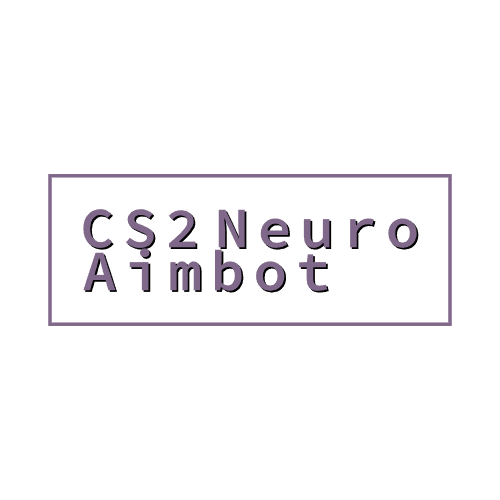

<a id="readme-top"></a>

[![MIT License][license-shield]][license-url]

<br />
<div align="center">
  <a href="https://github.com/ADHDprogrammer52/CS2_Neuro_Aimbot/">
    
  </a>

  <h3 align="center">Counter-Strike2 Neuro Aimbot</h3>

</div>


## About The Project


https://github.com/user-attachments/assets/782af631-4523-4210-89a2-ddfcbd2e59e6


CS2-Neuro Aimbot is a powerful aimbot created for Counter-Strike 2. He uses yolov8 to help you target enemies in real time. The best part is that at the moment it is (most likely) impossible to detect by any anti-cheat systems, because we do not change the memory of the game, unlike ordinary cheats.

Key feature:

- Customizable for Other Games: Despite my default models for Counter-Strike 2, yolo models can be retrained for other games such as Valorant by providing a suitable dataset.

By using your own dataset and training the model, this aim bot can also be customized for any other games, providing the same level of performance. Simply train the model on game-specific data to create an almost undetectable aim bot.

This project is intended for educational purposes and personal testing, offering insights into how AI can be applied to gaming environments.


## Getting Started

Follow these steps to get the project running locally:

### Prerequisites

You'll need the following dependencies installed on your system:

- Python 3.8+ (I used python 3.11.3)

- CUDA-compatible GPU (NVIDIA) (I used RTX 3060 with tensorRT)

### Installation

1. Clone the repo:
   ```sh
   git clone https://github.com/ADHDprogrammer52/CS2_Neuro_Aimbot.git
   ```
2. Go to aimbot folder:
   ```sh
   cd aimbot
   ```
3. Install the required dependencies:
   ```sh
   pip install -r requirements.txt
   ```
4. Run the GPU compatibility test to ensure your system is set up correctly:
   ```sh
   python cuda_test.py
   ```
   correct output:
   ```sh
   Torch version: 2.3.1+cu121
   Is CUDA enabled?: True
   ```
5. Start aimbot:
   ```sh
   python main_version.py
   ```

## Some points

- If you get errors related to opencv(cv2), try changing the resolution in the game.(I do not know how to fix it)

- If your crosshair flies off somewhere in the game when an object is detected, then just change the variables: 'min_speed' and 'max_speed'.
- Use files with .pt extensions to run with cuda cores or with the .engine extension to run with tensor cores(only RTX).

- If you have an RTX series graphics card, then for a significant increase in performance and detection speed, I recommend using tensorrt (you need to use models with the .engine extension) and download the sdk: https://developer.nvidia.com/tensorrt

- Also present matchmaking_version.py for team game modes, but my dataset is small enough, so the model doesn't work well with classification. I do not recommend using it.

- This project is best suited for educational purposes and is not intended for unfair competitive use.

## Thanks for the help in testing

[https://github.com/Fenantos](https://github.com/Fenantos)


## License

Distributed under the MIT License. See `LICENSE.txt` for more information.


## Acknowledgments

- [YOLO](https://docs.ultralytics.com/)


[license-shield]: https://img.shields.io/github/license/othneildrew/Best-README-Template.svg?style=for-the-badge
[license-url]: https://github.com/ADHDprogrammer52/CS2_Neuro_Aimbot/blob/main/LICENSE
